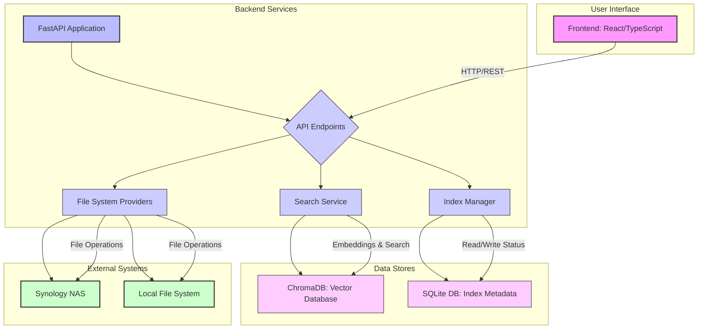

# 시스템 아키텍처 다이어그램

본 문서는 AI 기반 Synology NAS 파일 관리 시스템의 고수준 아키텍처를 시각적으로 표현한 다이어그램과 설명을 제공합니다.

## 다이어그램 설명

*   **User Interface (Frontend):** React/TypeScript로 개발된 웹 기반 사용자 인터페이스입니다. 사용자의 요청을 받아 백엔드 서비스와 통신합니다.
*   **Backend Services (FastAPI Application):** Python FastAPI 기반의 백엔드 애플리케이션입니다.
    *   **API Endpoints:** 프론트엔드 및 다른 서비스의 요청을 처리하는 RESTful API를 제공합니다.
    *   **File System Providers:** 로컬 파일 시스템 또는 Synology NAS와 같은 외부 시스템에 대한 파일 및 디렉터리 작업을 추상화하여 처리합니다.
    *   **Search Service:** `sentence-transformers` 모델을 사용하여 텍스트 임베딩을 생성하고, `ChromaDB`를 통해 벡터 유사도 검색을 수행합니다.
    *   **Index Manager:** 파일 및 폴더의 인덱싱 상태, 마지막 인덱싱 시간 등 메타데이터를 `SQLite DB`에 저장하고 관리합니다.
*   **Data Stores:**
    *   **ChromaDB (Vector Database):** 텍스트 청크의 임베딩 벡터를 저장하고 고속 유사도 검색을 지원합니다.
    *   **SQLite DB (Index Metadata):** 인덱싱된 폴더의 상태 및 관련 메타데이터를 저장합니다.
*   **External Systems:**
    *   **Synology NAS:** 실제 파일이 저장되는 외부 네트워크 스토리지입니다.
    *   **Local File System:** 개발 환경 또는 로컬 파일 관리를 위한 파일 시스템입니다.

이 다이어그램은 시스템의 주요 구성 요소와 이들 간의 데이터 흐름 및 상호작용을 보여줍니다.
